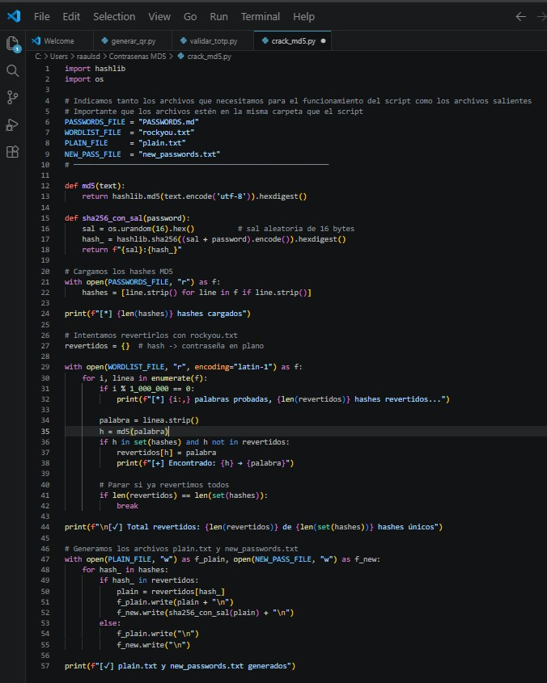
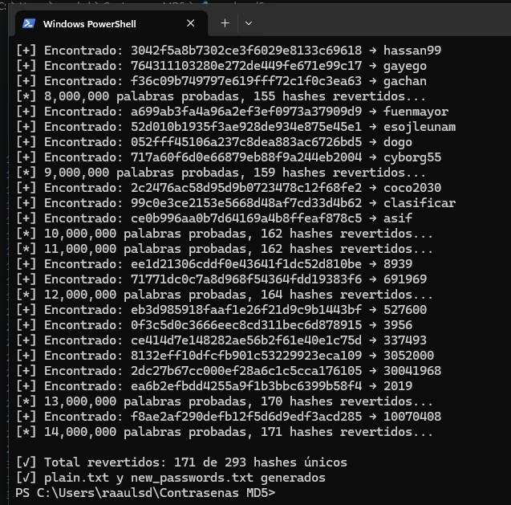
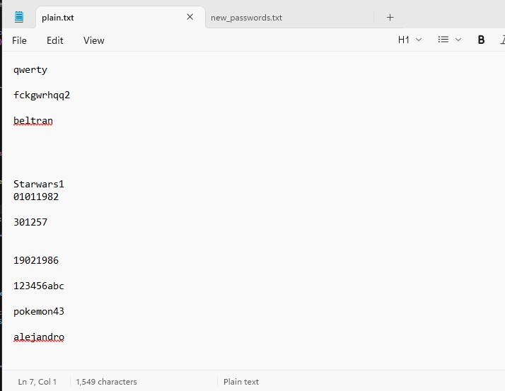
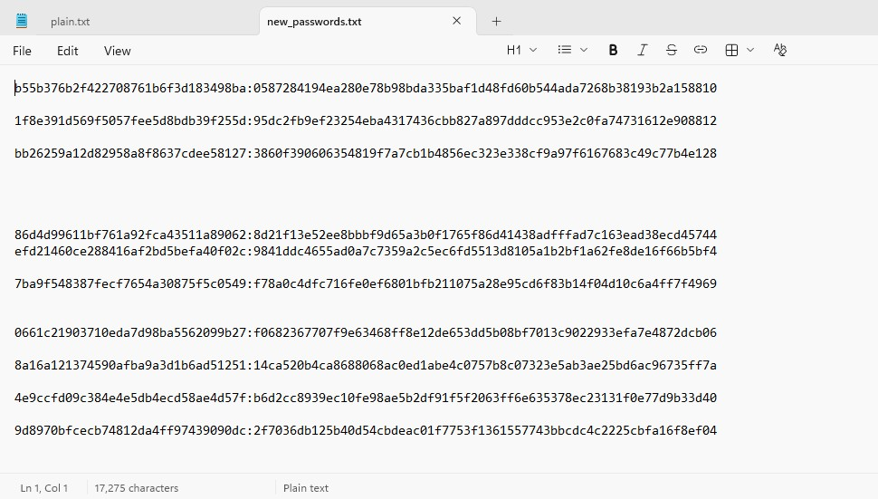

# 🔐 MD5 Password Migrator

Script en Python para revertir contraseñas hasheadas en MD5 (sin sal) y migrarlas
a un almacenamiento más seguro usando **SHA256 con sal**, siguiendo buenas prácticas
de seguridad en el almacenamiento de credenciales.

## ¿Por qué migrar de MD5 a SHA256 con sal?

MD5 sin sal es vulnerable a ataques de diccionario y tablas rainbow, ya que el mismo
texto produce siempre el mismo hash. SHA256 con sal añade un valor aleatorio único
por contraseña antes de hashear, lo que hace que dos contraseñas iguales generen
hashes distintos y elimina la eficacia de las tablas rainbow.

## ¿Cómo funciona?

1. Se cargan los hashes MD5 del fichero de entrada
2. Se recorre un diccionario de contraseñas comunes (`rockyou.txt`) calculando el MD5
   de cada palabra y comparándolo con los hashes objetivo
3. Para cada hash revertido se genera un nuevo hash SHA256 con una sal aleatoria de 16 bytes,
   almacenado en formato `sal:sha256hash`
4. Se generan los ficheros de salida manteniendo la correspondencia línea a línea

## Requisitos

```bash
pip install hashlib
```

Además necesitas el diccionario `rockyou.txt`. Puedes descargarlo desde:
```
https://github.com/brannondorsey/naive-hashcat/releases/download/data/rockyou.txt
```

## Uso

```bash
python crack_md5.py
```

Asegúrate de tener en la misma carpeta `PASSWORDS.md` y `rockyou.txt` antes de ejecutarlo.

## Proceso

### 1. El script

`crack_md5.py` carga los hashes MD5, recorre el diccionario y genera los ficheros de salida
de forma automática.



### 2. Ejecución

Durante la ejecución se muestra el progreso e imprime cada hash revertido junto a su
contraseña en plano.



Se consiguieron revertir **171 de 293 hashes únicos**. Los 122 restantes no pudieron
ser crackeados porque MD5 es una función unidireccional — no existe forma matemática
de revertirla, solo se puede "adivinar" la contraseña probando candidatos del diccionario
y comparando el resultado. Si la contraseña original no aparece en `rockyou.txt`
(por ser poco común, compleja, muy larga o personalizada), el hash queda sin revertir.

### 3. Resultado — plain.txt

Contraseñas revertidas a texto plano. Las líneas en blanco corresponden a hashes que
no pudieron ser crackeados con el diccionario utilizado.



### 4. Resultado — new_passwords.txt

Nuevos hashes generados en formato `sal:sha256hash`. Al igual que en `plain.txt`,
las líneas en blanco corresponden a contraseñas que no se pudieron revertir y por
tanto no se pudo generar su nuevo hash.



## Archivos del repositorio

Los ficheros `crack_md5.py`, `plain.txt` y `new_passwords.txt` están disponibles en
este repositorio para su descarga y uso directo. Con este script y los ficheros generados
queda automatizado el proceso completo de migración de contraseñas de MD5 sin sal
a SHA256 con sal, listo para integrarse en cualquier sistema que necesite mejorar
su seguridad en el almacenamiento de credenciales.
